[toc]

# YOLOV5

## 环境配置

项目地址：[ultralytics/yolov5: YOLOv5 🚀 in PyTorch > ONNX > CoreML > TFLite (github.com)](https://github.com/ultralytics/yolov5)

1.选择特定tags

2.在pycharm配置对应conda环境

3.作者提供requirements.txt文件

- 可以利用pycharm自带智能提示安装

- 利用pip install -r requirements.txt

4.若作者没有提供requirements.txt

- 根据报错信息 百度 安装缺少的库


## issue

### 使用低版本会遇到的错误

:heavy_exclamation_mark:warning：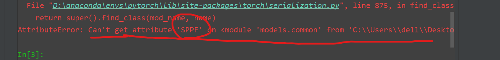

说在models.py中找不到SPPF这个类，解决方法如下：

如果你用的是Tags5的话,就去Tags6里面的models/common.py里面去找到这个SPPF的类,把它拷过来到你这个Tags5的models/common.py里面,这样你的代码就也有这个类了,还要在Tags5的models/common.py里引入一个warnings包就可以了。
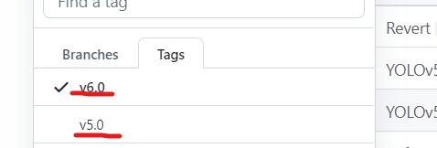

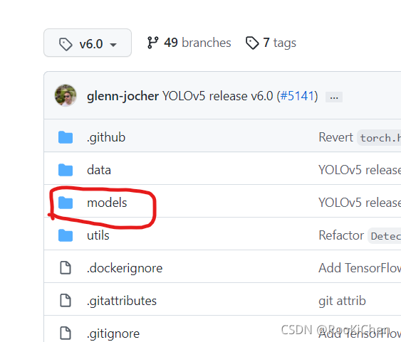

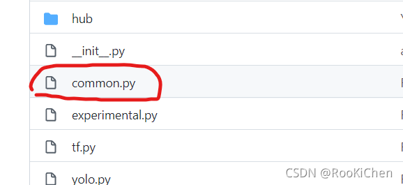

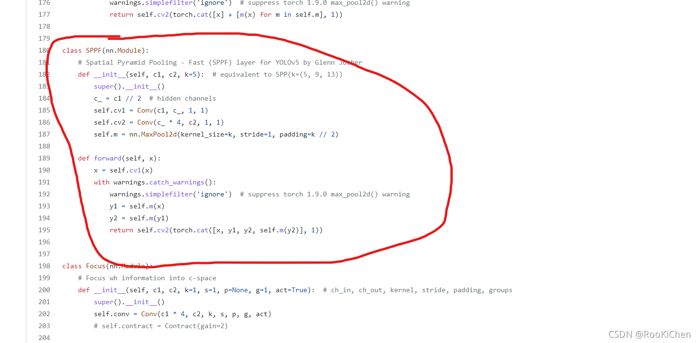

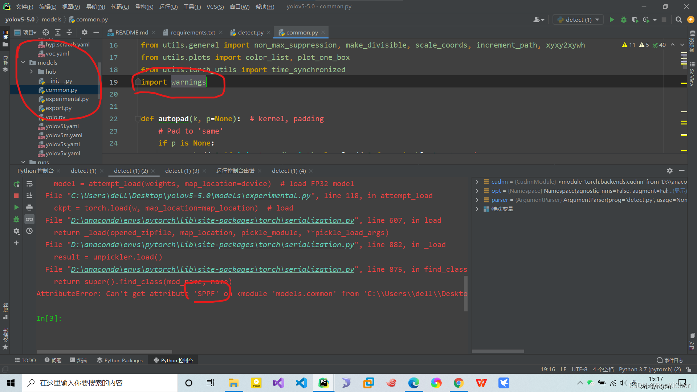


### macos环境报错

在detect.py头文件中

``` python
import os
os.environ['KMP_DUPLICATE_OK'] = 'True'
```


## detect参数

```python
parser.add_argument('--weights', nargs='+', type=str, default='yolov5s.pt', help='model.pt path(s)')
```

### --weights

- 权重


### --source

- 来源


### --conf-thres

- 是该分类的概率是多少才给予显示


### --iou-thres

- NMS-non maximum suppression（非极大值抑制）

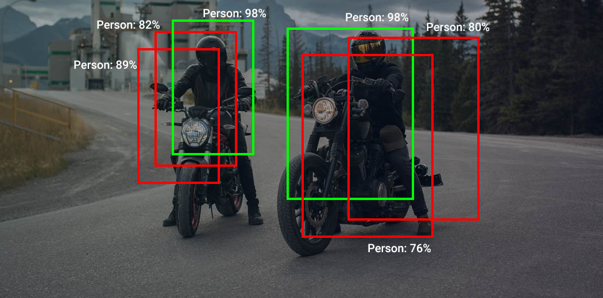

- iou- 交并比

 计算公式：

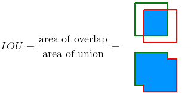


eg：当iou大于某个阈值，就会从多个框中选择一个合适的框

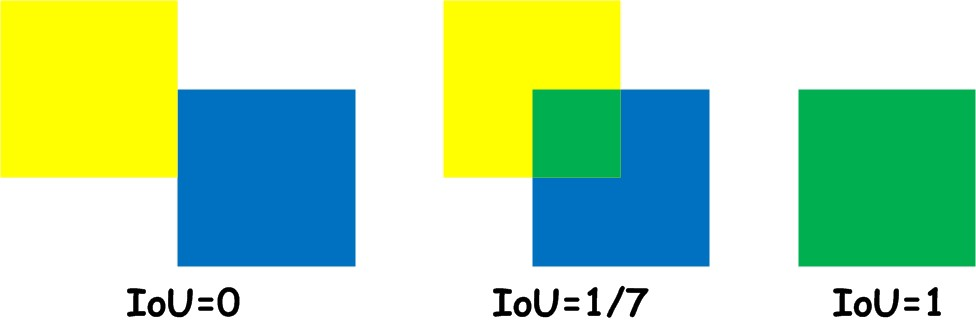


- iou= 1


- Iou = 0.45

  


- Iou = 0（iou>0,就会认为多个框是同一个目标）


### --view-img

- 画面实时显示

1. 在terminal中：

​		python detect.py -- view-img


2. 在项目主修改参数

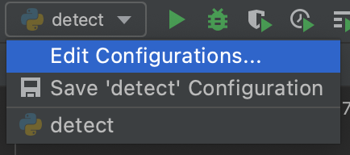

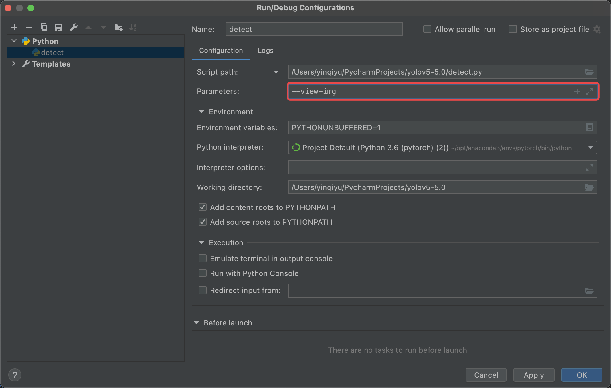

可以实时查看视频图片识别情况

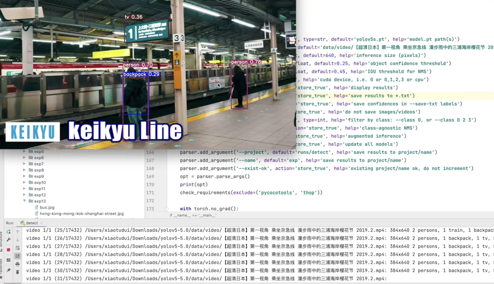


### --classes

- 筛选检测

--classes 0 只检测人


### --argument

增强检测


## detect默认值

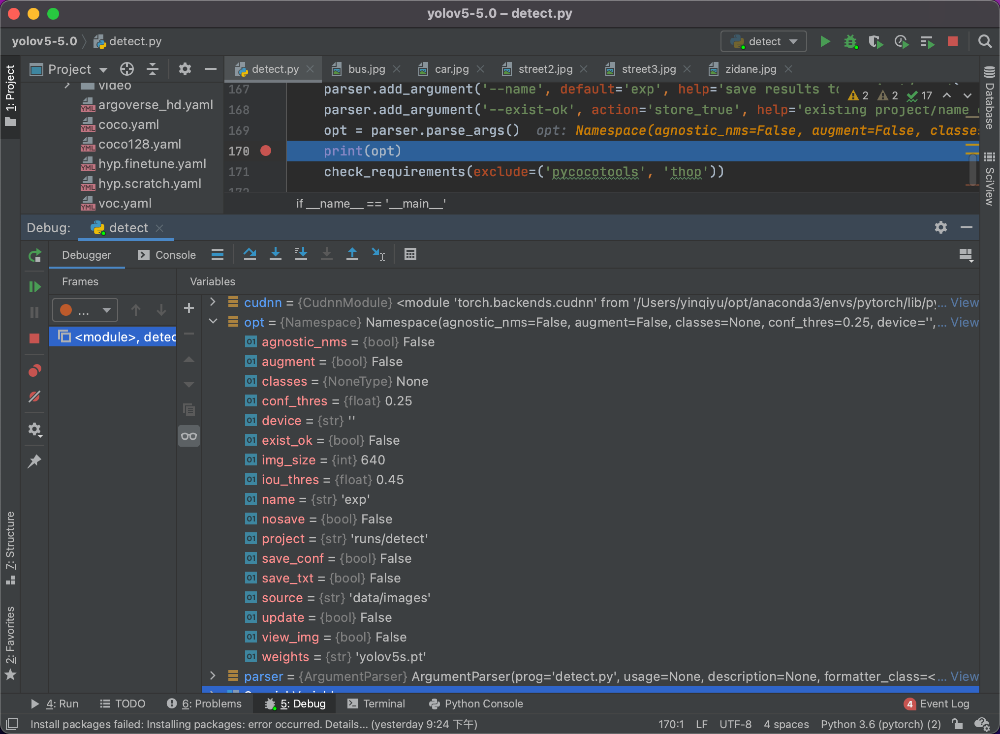


##  训练YOLOv5神经网络

### 本地上训练

- 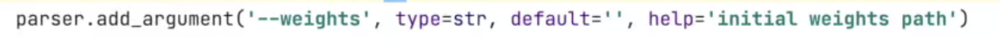

在别人模型的基础上进行训练

Yolov5s.pt

Yolov5m.pt

Yolov5l.pt

Yolov5x.pt


- 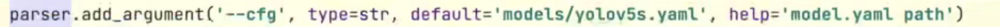

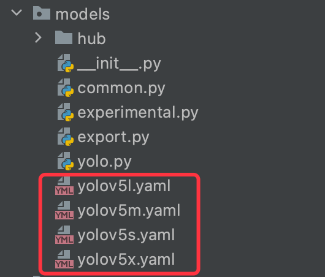


- 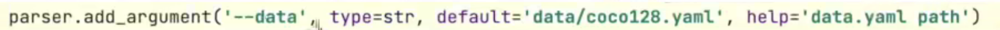

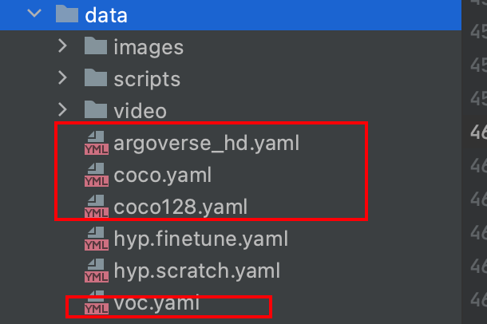


- 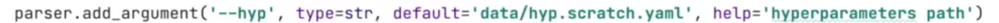

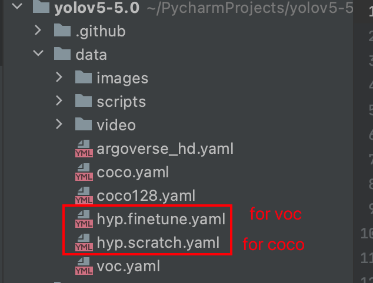


- 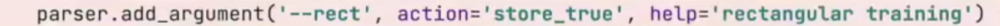

矩阵填充

old：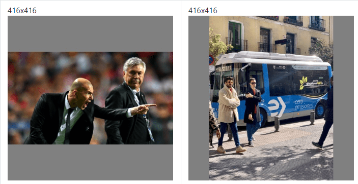


new：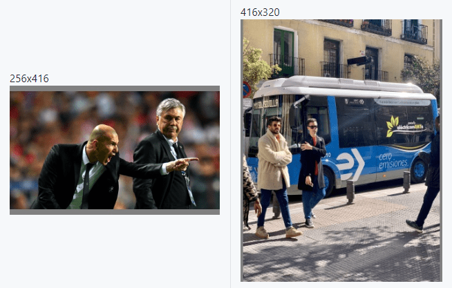


- 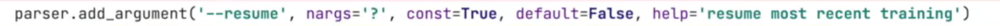

断点续训练：

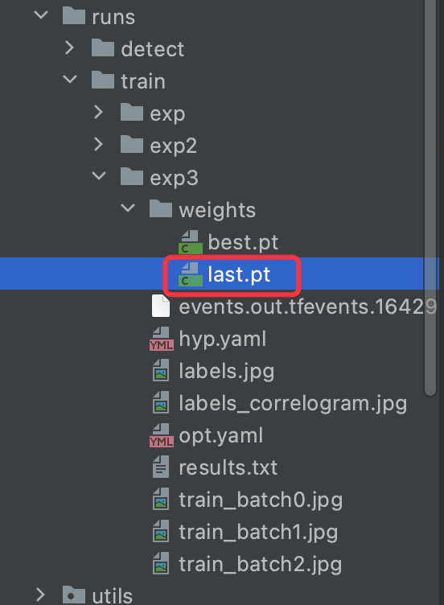


- 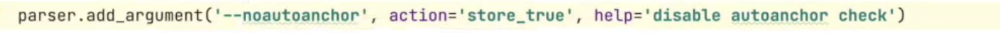

锚点

锚框

:star:（自学）


- 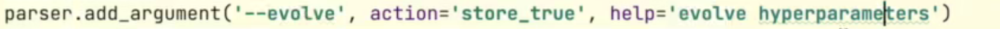

净化参数


- 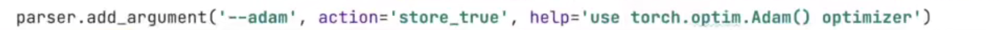

adam 优化器

不开启默认梯度下降


### 云端训练

压缩项目，上传云端

``` 
!unzip /content/yolov5-5.0.zip -d /content/yolov5
```

``` 
!rm -rf /content/yolov5/__MACOSX
```

``` 
%cd /content/yolov5/yolov5-5.0
```

```
!pip install -r requirements.txt
```

``` 
%load_ext tensorboard
```

``` 
%tensorboard --logdir=runs/train
```

```
!python train.py --rect
```

```
!python train.py --rect --data=data/coco.yaml
```


查询显卡

```
!/opt/bin/nvidia-smi
```


## 制作训练数据集


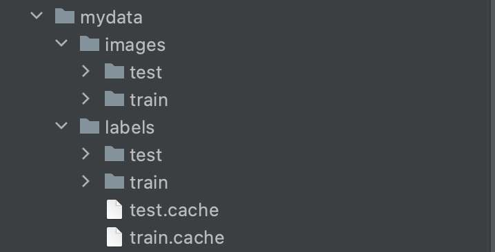
