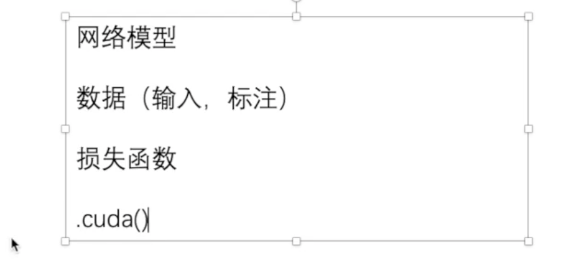

[toc] 

# pytorch

jupyter notebook --allow-root

ssh -L8888:localhost:8888 root@47.99.64.50
Nyw666!!


git失效时候

git config --global http.sslVerify false 


```
pip install mediapipe opencv-python numpy matplotlib tqdm jupyter notebook -i https://pypi.tuna.tsinghua.edu.cn/simple
```


查看是否能用cuda


torch.cuda.is_available


## conda

conda atvivate pytorch

jupyter pytorch


### 安装卸载库

启动环境：conda activate (name)

卸载库：pip uninstall opencv-python


 tensorboard --logdir=logs --port=6007

tensorboard --logdir=logs  

设置端口避免冲突


将jpg格式转换numpy类型


compose的用法


随机抓取


卷积


用gpu跑模型

方式1




方式2


issue：gpu跑的模型在cpu运行


